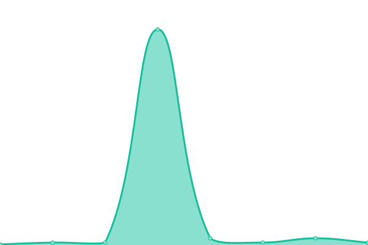
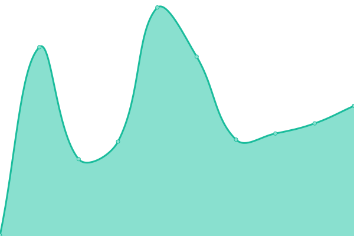

# [📈 Live Status](https://FaronFaron.github.io/upptime): <!--live status--> **🟧 Partial outage**

This repository contains the open-source uptime monitor and status page for [Faron](Faron.com), powered by [Upptime](https://github.com/upptime/upptime).

With [Upptime](https://upptime.js.org), you can get your own unlimited and free uptime monitor and status page, powered entirely by a GitHub repository. We use [Issues](https://github.com/FaronFaron/upptime/issues) as incident reports, [Actions](https://github.com/FaronFaron/upptime/actions) as uptime monitors, and [Pages](https://FaronFaron.github.io/upptime) for the status page.

<!--start: status pages-->
<!-- This summary is generated by Upptime (https://github.com/upptime/upptime) -->
<!-- Do not edit this manually, your changes will be overwritten -->
<!-- prettier-ignore -->
| URL | Status | History | Response Time | Uptime |
| --- | ------ | ------- | ------------- | ------ |
|  [Google](google.com) | 🟩 Up | [google.yml](https://github.com/FaronFaron/upptime/commits/HEAD/history/google.yml) | 

 127ms
     
 | 

<a href="https://FaronFaron.github.io/upptime/history/google">100.00%</a>
    

|  [Youtube](youtube.com) | 🟩 Up | [youtube.yml](https://github.com/FaronFaron/upptime/commits/HEAD/history/youtube.yml) | 

 305ms
     
 | 

<a href="https://FaronFaron.github.io/upptime/history/youtube">100.00%</a>
    

|  [Facebook](facebook.com) | 🟩 Up | [facebook.yml](https://github.com/FaronFaron/upptime/commits/HEAD/history/facebook.yml) | 

 633ms
     
 | 

<a href="https://FaronFaron.github.io/upptime/history/facebook">100.00%</a>
    

|  [Reddit](reddit.com) | 🟥 Down | [reddit.yml](https://github.com/FaronFaron/upptime/commits/HEAD/history/reddit.yml) | 

 391ms
     
 | 

<a href="https://FaronFaron.github.io/upptime/history/reddit">0.05%</a>
    

|  [Twitter](twitter.com) | 🟩 Up | [twitter.yml](https://github.com/FaronFaron/upptime/commits/HEAD/history/twitter.yml) | 

 363ms
     
 | 

<a href="https://FaronFaron.github.io/upptime/history/twitter">100.00%</a>
    

|  [Instagram](instagram.com) | 🟩 Up | [instagram.yml](https://github.com/FaronFaron/upptime/commits/HEAD/history/instagram.yml) | 

 1244ms
     
 | 

<a href="https://FaronFaron.github.io/upptime/history/instagram">100.00%</a>
    

|  [Linkedin](linkedin.com) | 🟩 Up | [linkedin.yml](https://github.com/FaronFaron/upptime/commits/HEAD/history/linkedin.yml) | 

 365ms
     
 | 

<a href="https://FaronFaron.github.io/upptime/history/linkedin">100.00%</a>
    

|  [Netflix](netflix.com) | 🟩 Up | [netflix.yml](https://github.com/FaronFaron/upptime/commits/HEAD/history/netflix.yml) | 

 1048ms
     
 | 

<a href="https://FaronFaron.github.io/upptime/history/netflix">100.00%</a>
    

|  [Twitch](twitch.tv) | 🟩 Up | [twitch.yml](https://github.com/FaronFaron/upptime/commits/HEAD/history/twitch.yml) | 

 136ms
     
 | 

<a href="https://FaronFaron.github.io/upptime/history/twitch">100.00%</a>
    

|  [Steam](store.steampowered.com) | 🟩 Up | [steam.yml](https://github.com/FaronFaron/upptime/commits/HEAD/history/steam.yml) | 

 589ms
     
 | 

<a href="https://FaronFaron.github.io/upptime/history/steam">100.00%</a>
    

|  [Discordapp](discordapp.com) | 🟩 Up | [discordapp.yml](https://github.com/FaronFaron/upptime/commits/HEAD/history/discordapp.yml) | 

 195ms
     
 | 

<a href="https://FaronFaron.github.io/upptime/history/discordapp">100.00%</a>
    

|  [Amazon](amazon.com) | 🟩 Up | [amazon.yml](https://github.com/FaronFaron/upptime/commits/HEAD/history/amazon.yml) | 

 302ms
     
 | 

<a href="https://FaronFaron.github.io/upptime/history/amazon">100.00%</a>
    

|  [Wikipedia](wikipedia.org) | 🟩 Up | [wikipedia.yml](https://github.com/FaronFaron/upptime/commits/HEAD/history/wikipedia.yml) | 

 207ms
     
 | 

<a href="https://FaronFaron.github.io/upptime/history/wikipedia">100.00%</a>
    

|  [Yahoo](yahoo.com) | 🟩 Up | [yahoo.yml](https://github.com/FaronFaron/upptime/commits/HEAD/history/yahoo.yml) | 

 963ms
     
 | 

<a href="https://FaronFaron.github.io/upptime/history/yahoo">100.00%</a>
    

|  [Ebay](ebay.com) | 🟩 Up | [ebay.yml](https://github.com/FaronFaron/upptime/commits/HEAD/history/ebay.yml) | 

 937ms
     
 | 

<a href="https://FaronFaron.github.io/upptime/history/ebay">100.00%</a>
    

|  [Baidu](baidu.com) | 🟩 Up | [baidu.yml](https://github.com/FaronFaron/upptime/commits/HEAD/history/baidu.yml) | 

 600ms
     
 | 

<a href="https://FaronFaron.github.io/upptime/history/baidu">100.00%</a>
    

|  [Imgur](imgur.com) | 🟩 Up | [imgur.yml](https://github.com/FaronFaron/upptime/commits/HEAD/history/imgur.yml) | 

 60ms
     
 | 

<a href="https://FaronFaron.github.io/upptime/history/imgur">100.00%</a>
    

|  [Craigslist](craigslist.org) | 🟥 Down | [craigslist.yml](https://github.com/FaronFaron/upptime/commits/HEAD/history/craigslist.yml) | 

 0ms
     
 | 

<a href="https://FaronFaron.github.io/upptime/history/craigslist">0.12%</a>
    

|  [Imdb](imdb.com) | 🟩 Up | [imdb.yml](https://github.com/FaronFaron/upptime/commits/HEAD/history/imdb.yml) | 

 1011ms
     
 | 

<a href="https://FaronFaron.github.io/upptime/history/imdb">100.00%</a>
    

|  [Pinterest](pinterest.com) | 🟩 Up | [pinterest.yml](https://github.com/FaronFaron/upptime/commits/HEAD/history/pinterest.yml) | 

 404ms
     
 | 

<a href="https://FaronFaron.github.io/upptime/history/pinterest">100.00%</a>
    

|  [Paypal](paypal.com) | 🟩 Up | [paypal.yml](https://github.com/FaronFaron/upptime/commits/HEAD/history/paypal.yml) | 

 538ms
     
 | 

<a href="https://FaronFaron.github.io/upptime/history/paypal">100.00%</a>
    

|  [Stackoverflow](stackoverflow.com) | 🟩 Up | [stackoverflow.yml](https://github.com/FaronFaron/upptime/commits/HEAD/history/stackoverflow.yml) | 

 194ms
     
 | 

<a href="https://FaronFaron.github.io/upptime/history/stackoverflow">100.00%</a>
    

|  [Tumblr](tumblr.com) | 🟩 Up | [tumblr.yml](https://github.com/FaronFaron/upptime/commits/HEAD/history/tumblr.yml) | 

 447ms
     
 | 

<a href="https://FaronFaron.github.io/upptime/history/tumblr">100.00%</a>
    

|  [Live](live.com) | 🟩 Up | [live.yml](https://github.com/FaronFaron/upptime/commits/HEAD/history/live.yml) | 

 875ms
     
 | 

<a href="https://FaronFaron.github.io/upptime/history/live">100.00%</a>
    

|  [Chase](chase.com) | 🟩 Up | [chase.yml](https://github.com/FaronFaron/upptime/commits/HEAD/history/chase.yml) | 

 280ms
     
 | 

<a href="https://FaronFaron.github.io/upptime/history/chase">100.00%</a>
    

|  [Bing](bing.com) | 🟩 Up | [bing.yml](https://github.com/FaronFaron/upptime/commits/HEAD/history/bing.yml) | 

 65ms
     
 | 

<a href="https://FaronFaron.github.io/upptime/history/bing">100.00%</a>
    

|  [Fandom](fandom.com) | 🟩 Up | [fandom.yml](https://github.com/FaronFaron/upptime/commits/HEAD/history/fandom.yml) | 

 152ms
     
 | 

<a href="https://FaronFaron.github.io/upptime/history/fandom">100.00%</a>
    

|  [Espn](espn.com) | 🟩 Up | [espn.yml](https://github.com/FaronFaron/upptime/commits/HEAD/history/espn.yml) | 

 215ms
     
 | 

<a href="https://FaronFaron.github.io/upptime/history/espn">100.00%</a>
    

|  [Cnn](cnn.com) | 🟩 Up | [cnn.yml](https://github.com/FaronFaron/upptime/commits/HEAD/history/cnn.yml) | 

 121ms
     
 | 

<a href="https://FaronFaron.github.io/upptime/history/cnn">100.00%</a>
    

|  [Office](office.com) | 🟩 Up | [office.yml](https://github.com/FaronFaron/upptime/commits/HEAD/history/office.yml) | 

 70ms
     
 | 

<a href="https://FaronFaron.github.io/upptime/history/office">100.00%</a>
    

|  [Microsoft](microsoft.com) | 🟥 Down | [microsoft.yml](https://github.com/FaronFaron/upptime/commits/HEAD/history/microsoft.yml) | 

 0ms
     
 | 

<a href="https://FaronFaron.github.io/upptime/history/microsoft">5.65%</a>
    

|  [Hulu](hulu.com) | 🟩 Up | [hulu.yml](https://github.com/FaronFaron/upptime/commits/HEAD/history/hulu.yml) | 

 1021ms
     
 | 

<a href="https://FaronFaron.github.io/upptime/history/hulu">100.00%</a>
    

|  [Nytimes](nytimes.com) | 🟩 Up | [nytimes.yml](https://github.com/FaronFaron/upptime/commits/HEAD/history/nytimes.yml) | 

 356ms
     
 | 

<a href="https://FaronFaron.github.io/upptime/history/nytimes">100.00%</a>
    

|  [Force](force.com) | 🟩 Up | [force.yml](https://github.com/FaronFaron/upptime/commits/HEAD/history/force.yml) | 

 970ms
     
 | 

<a href="https://FaronFaron.github.io/upptime/history/force">100.00%</a>
    

|  [Salesforce](salesforce.com) | 🟩 Up | [salesforce.yml](https://github.com/FaronFaron/upptime/commits/HEAD/history/salesforce.yml) | 

 596ms
     
 | 

<a href="https://FaronFaron.github.io/upptime/history/salesforce">100.00%</a>
    

|  [Alibaba](alibaba.com) | 🟩 Up | [alibaba.yml](https://github.com/FaronFaron/upptime/commits/HEAD/history/alibaba.yml) | 

 1858ms
     
 | 

<a href="https://FaronFaron.github.io/upptime/history/alibaba">100.00%</a>
    

|  [Github](github.com) | 🟩 Up | [github.yml](https://github.com/FaronFaron/upptime/commits/HEAD/history/github.yml) | 

 200ms
     
 | 

<a href="https://FaronFaron.github.io/upptime/history/github">100.00%</a>
    

|  [Apple](apple.com) | 🟩 Up | [apple.yml](https://github.com/FaronFaron/upptime/commits/HEAD/history/apple.yml) | 

 500ms
     
 | 

<a href="https://FaronFaron.github.io/upptime/history/apple">100.00%</a>
    

|  [Zillow](zillow.com) | 🟥 Down | [zillow.yml](https://github.com/FaronFaron/upptime/commits/HEAD/history/zillow.yml) | 

 304ms
     
 | 

<a href="https://FaronFaron.github.io/upptime/history/zillow">0.04%</a>
    

|  [Walmart](walmart.com) | 🟩 Up | [walmart.yml](https://github.com/FaronFaron/upptime/commits/HEAD/history/walmart.yml) | 

 1139ms
     
 | 

<a href="https://FaronFaron.github.io/upptime/history/walmart">100.00%</a>
    

|  [Yelp](yelp.com) | 🟩 Up | [yelp.yml](https://github.com/FaronFaron/upptime/commits/HEAD/history/yelp.yml) | 

 1024ms
     
 | 

<a href="https://FaronFaron.github.io/upptime/history/yelp">100.00%</a>
    

|  [Bankofamerica](bankofamerica.com) | 🟩 Up | [bankofamerica.yml](https://github.com/FaronFaron/upptime/commits/HEAD/history/bankofamerica.yml) | 

 1195ms
     
 | 

<a href="https://FaronFaron.github.io/upptime/history/bankofamerica">100.00%</a>
    

|  [Weather](weather.com) | 🟩 Up | [weather.yml](https://github.com/FaronFaron/upptime/commits/HEAD/history/weather.yml) | 

 362ms
     
 | 

<a href="https://FaronFaron.github.io/upptime/history/weather">100.00%</a>
    

|  [Dropbox](dropbox.com) | 🟩 Up | [dropbox.yml](https://github.com/FaronFaron/upptime/commits/HEAD/history/dropbox.yml) | 

 779ms
     
 | 

<a href="https://FaronFaron.github.io/upptime/history/dropbox">100.00%</a>
    

|  [Wellsfargo](wellsfargo.com) | 🟩 Up | [wellsfargo.yml](https://github.com/FaronFaron/upptime/commits/HEAD/history/wellsfargo.yml) | 

 494ms
     
 | 

<a href="https://FaronFaron.github.io/upptime/history/wellsfargo">100.00%</a>
    

|  [Indeed](indeed.com) | 🟥 Down | [indeed.yml](https://github.com/FaronFaron/upptime/commits/HEAD/history/indeed.yml) | 

 108ms
     
 | 

<a href="https://FaronFaron.github.io/upptime/history/indeed">0.05%</a>
    

|  [Etsy](etsy.com) | 🟥 Down | [etsy.yml](https://github.com/FaronFaron/upptime/commits/HEAD/history/etsy.yml) | 

 132ms
     
 | 

<a href="https://FaronFaron.github.io/upptime/history/etsy">0.01%</a>
    

|  [Adobe](adobe.com) | 🟥 Down | [adobe.yml](https://github.com/FaronFaron/upptime/commits/HEAD/history/adobe.yml) | 

 0ms
     
 | 

<a href="https://FaronFaron.github.io/upptime/history/adobe">0.03%</a>
    

|  [208.67.222.222](208.67.222.222) | 🟥 Down | [208-67-222-222.yml](https://github.com/FaronFaron/upptime/commits/HEAD/history/208-67-222-222.yml) | 

 15ms
     
 | 

<a href="https://FaronFaron.github.io/upptime/history/208-67-222-222">0.10%</a>
    

|  [208.67.220.220](208.67.220.220) | 🟥 Down | [208-67-220-220.yml](https://github.com/FaronFaron/upptime/commits/HEAD/history/208-67-220-220.yml) | 

 4ms
     
 | 

<a href="https://FaronFaron.github.io/upptime/history/208-67-220-220">0.00%</a>
    

|  [1.1.1.1](1.1.1.1) | 🟩 Up | [1-1-1-1.yml](https://github.com/FaronFaron/upptime/commits/HEAD/history/1-1-1-1.yml) | 

 176ms
     
 | 

<a href="https://FaronFaron.github.io/upptime/history/1-1-1-1">100.00%</a>
    

|  [1.0.0.1](1.0.0.1) | 🟩 Up | [1-0-0-1.yml](https://github.com/FaronFaron/upptime/commits/HEAD/history/1-0-0-1.yml) | 

 81ms
     
 | 

<a href="https://FaronFaron.github.io/upptime/history/1-0-0-1">100.00%</a>
    

|  [8.8.8.8](8.8.8.8) | 🟥 Down | [8-8-8-8.yml](https://github.com/FaronFaron/upptime/commits/HEAD/history/8-8-8-8.yml) | 

 0ms
     
 | 

<a href="https://FaronFaron.github.io/upptime/history/8-8-8-8">36.64%</a>
    

|  [8.8.4.4](8.8.4.4) | 🟥 Down | [8-8-4-4.yml](https://github.com/FaronFaron/upptime/commits/HEAD/history/8-8-4-4.yml) | 

 0ms
     
 | 

<a href="https://FaronFaron.github.io/upptime/history/8-8-4-4">60.89%</a>
    

<!--end: status pages-->

[**Visit our status website →**](https://FaronFaron.github.io/upptime)

## 📄 License

- Powered by: [Upptime](https://github.com/upptime/upptime)
- Code: [MIT](./LICENSE) © [Anand Chowdhary](https://anandchowdhary.com), supported by [Pabio](https://pabio.com)
- Data in the `./history` directory: [Open Database License](https://opendatacommons.org/licenses/odbl/1-0/)
