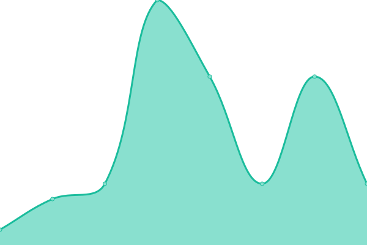

# [📈 Live Status](https://FaronFaron.github.io/upptime): <!--live status--> **🟧 Partial outage**

This repository contains the open-source uptime monitor and status page for [Faron](Faron.com), powered by [Upptime](https://github.com/upptime/upptime).

With [Upptime](https://upptime.js.org), you can get your own unlimited and free uptime monitor and status page, powered entirely by a GitHub repository. We use [Issues](https://github.com/FaronFaron/upptime/issues) as incident reports, [Actions](https://github.com/FaronFaron/upptime/actions) as uptime monitors, and [Pages](https://FaronFaron.github.io/upptime) for the status page.

<!--start: status pages-->
<!-- This summary is generated by Upptime (https://github.com/upptime/upptime) -->
<!-- Do not edit this manually, your changes will be overwritten -->
<!-- prettier-ignore -->
| URL | Status | History | Response Time | Uptime |
| --- | ------ | ------- | ------------- | ------ |
|  [208.67.222.222](208.67.222.222) | 🟥 Down | [208-67-222-222.yml](https://github.com/FaronFaron/upptime/commits/HEAD/history/208-67-222-222.yml) | 

 9ms
     
 | 

<a href="https://FaronFaron.github.io/upptime/history/208-67-222-222">0.00%</a>
    

|  [208.67.220.220](208.67.220.220) | 🟥 Down | [208-67-220-220.yml](https://github.com/FaronFaron/upptime/commits/HEAD/history/208-67-220-220.yml) | 

 45ms
     
 | 

<a href="https://FaronFaron.github.io/upptime/history/208-67-220-220">0.00%</a>
    

|  [1.1.1.1](1.1.1.1) | 🟩 Up | [1-1-1-1.yml](https://github.com/FaronFaron/upptime/commits/HEAD/history/1-1-1-1.yml) | 

 191ms
     
 | 

<a href="https://FaronFaron.github.io/upptime/history/1-1-1-1">100.00%</a>
    

|  [1.0.0.1](1.0.0.1) | 🟩 Up | [1-0-0-1.yml](https://github.com/FaronFaron/upptime/commits/HEAD/history/1-0-0-1.yml) | 

 103ms
     
 | 

<a href="https://FaronFaron.github.io/upptime/history/1-0-0-1">100.00%</a>
    

|  [8.8.8.8](8.8.8.8) | 🟥 Down | [8-8-8-8.yml](https://github.com/FaronFaron/upptime/commits/HEAD/history/8-8-8-8.yml) | 

 0ms
     
 | 

<a href="https://FaronFaron.github.io/upptime/history/8-8-8-8">0.01%</a>
    

|  [8.8.4.4](8.8.4.4) | 🟥 Down | [8-8-4-4.yml](https://github.com/FaronFaron/upptime/commits/HEAD/history/8-8-4-4.yml) | 

 0ms
     
 | 

<a href="https://FaronFaron.github.io/upptime/history/8-8-4-4">0.01%</a>
    

|  [cineb.rs](cineb.rs) | 🟩 Up | [cineb-rs.yml](https://github.com/FaronFaron/upptime/commits/HEAD/history/cineb-rs.yml) | 

 557ms
     
 | 

<a href="https://FaronFaron.github.io/upptime/history/cineb-rs">100.00%</a>
    

<!--end: status pages-->

[**Visit our status website →**](https://FaronFaron.github.io/upptime)

## 📄 License

- Powered by: [Upptime](https://github.com/upptime/upptime)
- Code: [MIT](./LICENSE) © [Anand Chowdhary](https://anandchowdhary.com), supported by [Pabio](https://pabio.com)
- Data in the `./history` directory: [Open Database License](https://opendatacommons.org/licenses/odbl/1-0/)
